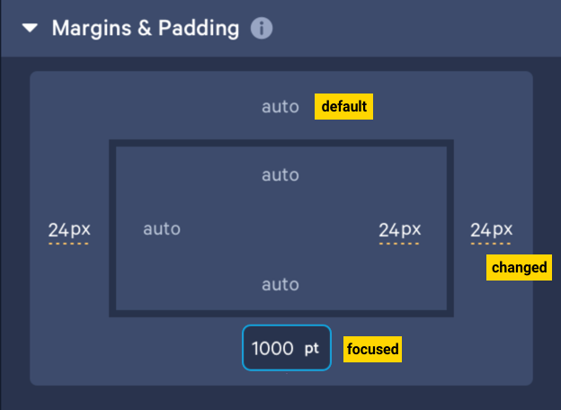

## Features

- **API Operations** for managing margin and padding values.
- **Dynamic Input Handling**: Users can enter values and select units for spacing properties.
- **Debounced Save**: Automatic saving of changes every 8 seconds if there is a modification.
- **Project Management**: Option to create new projects to start with fresh entries in the spacing table.

## API Endpoints

- `GET /spacing` - Retrieve spacing values for a component.
- `POST /spacing` - Create new spacing entries.
- `PATCH /spacing` - Update existing spacing values.

## Usage

1. **Creating New Project**: Click on the `+` button to create a new project.
2. **Viewing Default Spacing**: When the application loads, default margin and padding values are displayed.
3. **Editing Values**: Users can input values for margins and paddings. The dropdown allows selecting units.
4. **Auto-Save Feature**: Input changes are saved periodically based on user input.

## Known Issues

- Initial setup of project scripts for Windows compatibility.
- Incomplete translation of TypeScript code to ReScript (located in the `deprecated` folder).
